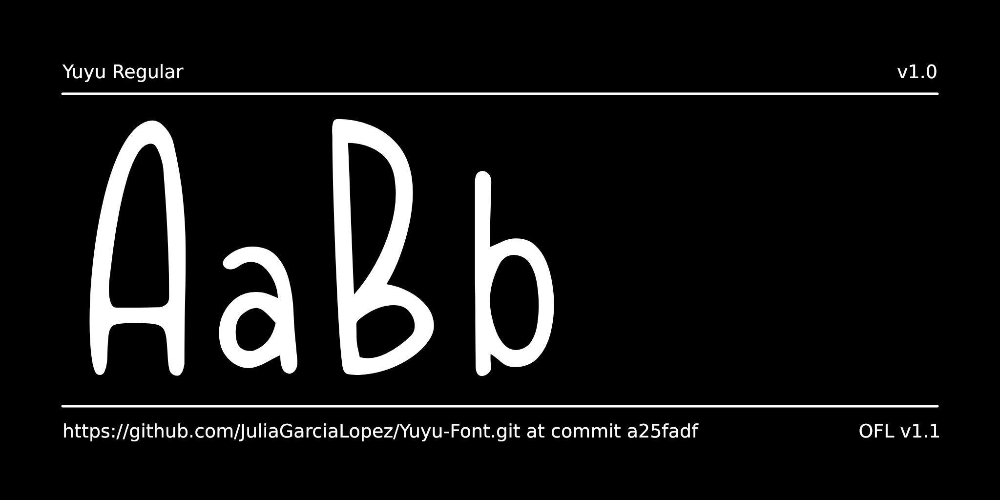
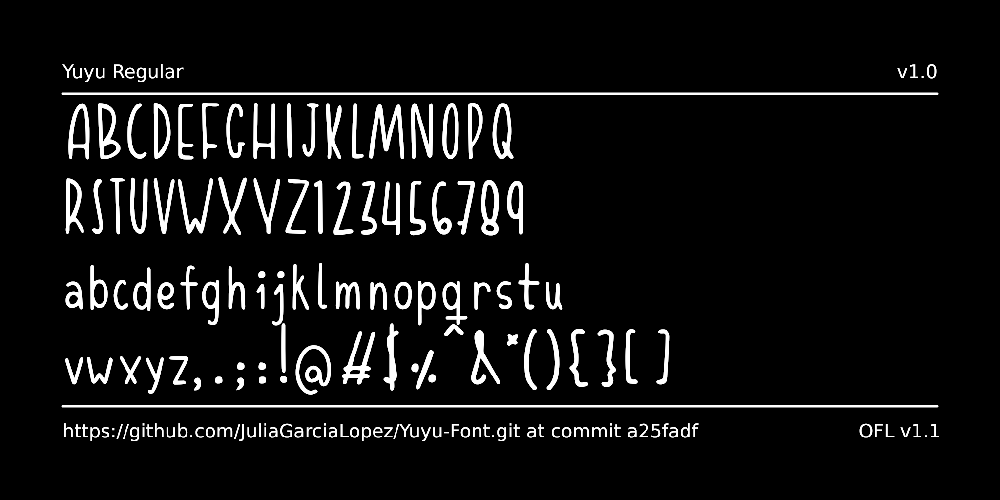
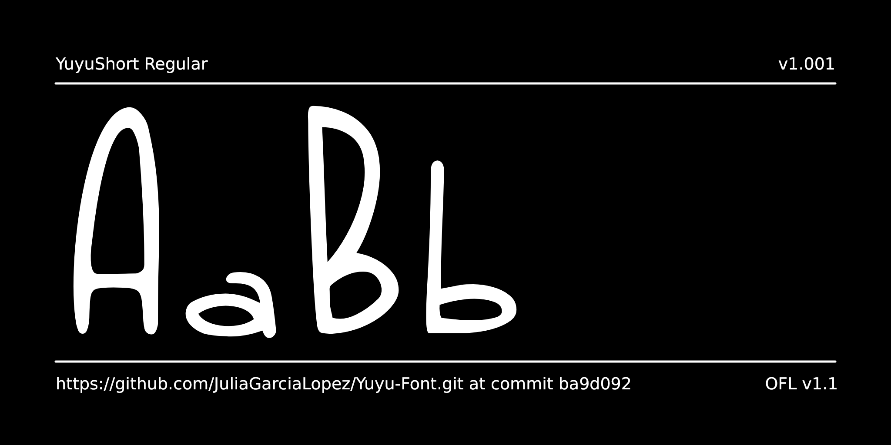
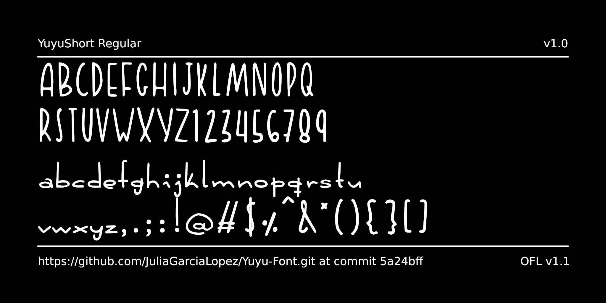

# My Font

**Yuyu Font** is a stylized and slender handwritten typeface designed by *Julia García López*. Originally conceived as a personal tool for the author's visual identity, this font is the result of years of manual refinement.

Morphology: Slim, uppercase characters with a pronounced verticality.

Personality: Fun and familiar, yet with a mature and cheerful finish.

Style: Handwritten / Display.

Recommended Use: Ideal for personal branding, editorials, modern titles, and projects seeking a friendly and human connection.

🖋️ **Styles**
The family consists of two variations that share capital letters: *Yuyu Mid* and *Yuyu Short*.

- **Yuyu Mid** was developed with a clear focus on legibility and accessibility.

- **Yuyu Short** is intended purely for aesthetic and display purposes.

📜 **Author's Note**
"This font is, in many ways, like a child to me. It has featured in every sketch and project for years. Seeing it today transformed into a complete typographic tool is the start of a new chapter. This is my voice, now available for yours." — Julia García López.

## About

Julia García López is a visual designer and artist with a degree in Fine Arts, whose practice lies at the intersection of traditional visual arts and digital experimentation. Originally from Seville, Spain, and with four years of experience living and exhibiting in the UK, Julia brings an international and multidisciplinary perspective to type design. Her aim is to create typefaces that not only communicate text but also capture the vibrancy and movement of the contemporary digital age. Follow her story at [Instagram](https://www.instagram.com/julia.garcia.lopez/) | [Website](https://thearteofjulia.es/)

## Building

Fonts are built automatically by GitHub Actions - take a look in the "Actions" tab for the latest build.

If you want to build fonts manually on your own computer:

- `make build` will produce font files.
- `make test` will run [FontBakery](https://github.com/googlefonts/fontbakery)'s quality assurance tests.
- `make proof` will generate HTML proof files.

The proof files and QA tests are also available automatically via GitHub Actions - look at https://JuliaGarciaLopez.github.io/Yuyu-Font.git.

## Changelog

**9 April 2026. Version 1.00**

- First version of Yuyu Font

**10 April 2026. Version 1.01**

- Sepparated font names for Yuyu mid and Yuyu short

**28 April 2026. Version 1.02**

- Improved vertical metrics
- Refined vertex superposition
- Completed math and number symbols
- Updated copyright and font data

## License

This Font Software is licensed under the SIL Open Font License, Version 1.1.
This license is available with a FAQ at https://openfontlicense.org

## Repository Layout

This font repository structure is inspired by [Unified Font Repository v0.3](https://github.com/unified-font-repository/Unified-Font-Repository), modified for the Google Fonts workflow.
